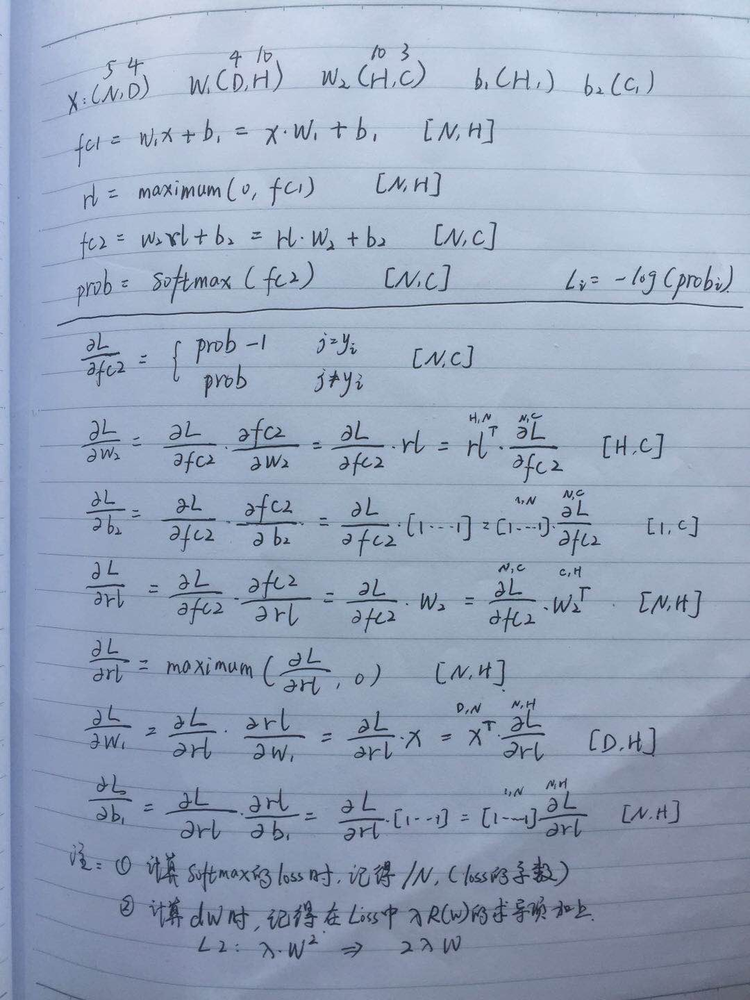

# A1Q4

### Two-Layer Neural Network 

- 按照公式写反向传播的代码

- 稍微进行了调优，val_acc: 0.547，test_val: 0.532

  ```
  {'reg': 0.001241504376788047, 'num_iters': 1000, 'learning_rate_decay': 0.95, 'learning_rate': 0.002, 'hidden_size': 300}
  ```



