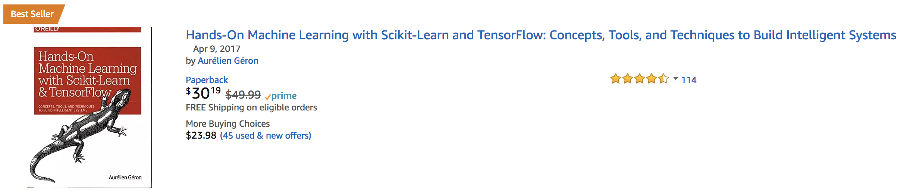
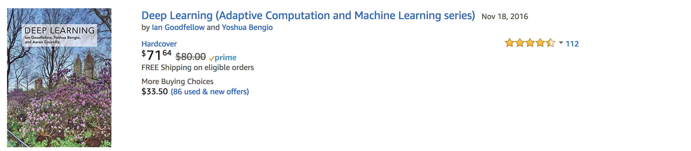
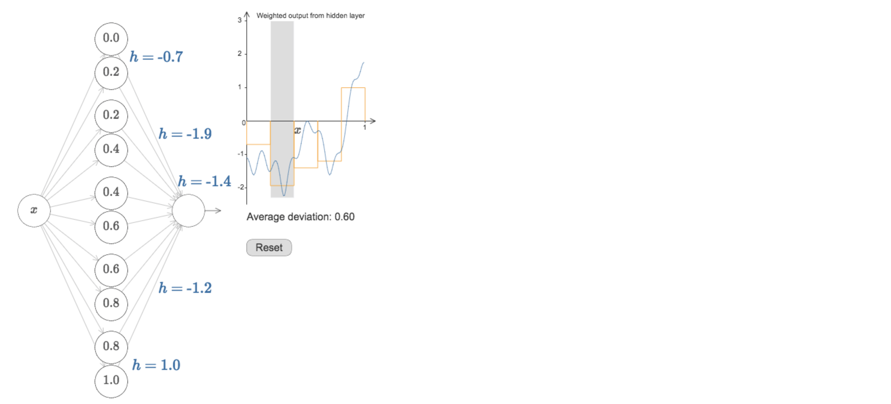
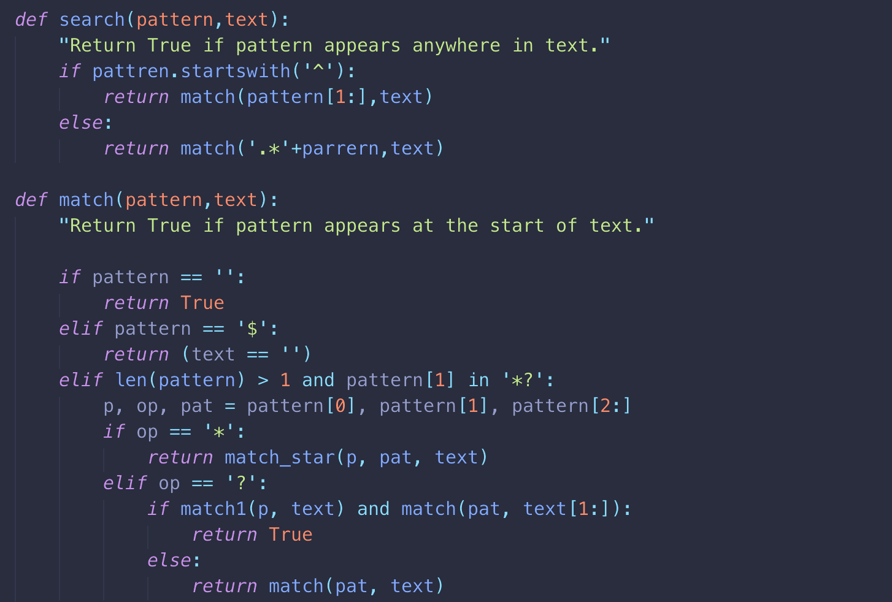

# 🐹 CS231n

- 阅读材料： [CS231n Convolutional Neural Networks for Visual Recognition](http://cs231n.github.io/)，[Schedule and Syllabus](http://cs231n.stanford.edu/syllabus.html)
- 课程链接：
  - [2017 英文字幕版](https://www.youtube.com/watch?v=6niqTuYFZLQ&list=PLe7764SJVnV10-Nr7e0sBlC9J0LRf4sQo)
  - [2016 英文字幕版](https://www.youtube.com/watch?v=NfnWJUyUJYU&list=PLkt2uSq6rBVctENoVBg1TpCC7OQi31AlC)
  - [2016 中文字幕版](https://study.163.com/course/introduction/1003223001.htm)
- 我们参照 [Stanford Honor Code](https://communitystandards.stanford.edu/student-conduct-process/honor-code-and-fundamental-standard) ，简而言之就是作业过程中可以讨论算法，但**自己实现前不可以看别人的代码**。

- 讨论组：
  - [Blog No.1](https://networkflow.net/forum/19-stanford-cs231n-convolutional-neural-networks-for-visual-recognition/) （这里有其他同学的解法，谨慎浏览，做完作业后可以来交流解法）
  - [Blog No.2](https://www.reddit.com/r/cs231n/)

  ​

### Deep Learning Books

- [Hands on Tensorflow](共享文件/Hands.On.TensorFlow.pdf) ----- 亚马逊评分4.7 作者是Youtube视频分类的负责人，作业非常棒，第9章开始是深度学习

- [Deep Learning](共享文件/deep learning.pdf) —— 亚马逊评分4.5，第一本系统介绍深度学习理论的书，作者是GAN发明人，建议做两个项目后再看，否则不好get他的点  

  

- [Neural Network and Deep Learning](http://neuralnetworksanddeeplearning.com/chap1.html) —— 非常好的入门课本，培养sense用，有很多能把玩的程序，直观感受为什么神经网络可以拟合任何函数  [大概20h看完]

### Python:

- [Design of Computer Programs](https://www.udacity.com/course/design-of-computer-programs--cs212)  —— 人工智能领域大神 Peter Novig 讲的课，很有挑战性，课上的实现都相当巧妙   [大概50h看完]

### Papers：

- [A Few Useful Things to Know about Machine Learning.pdf](共享文件/A Few Useful Things to Know about Machine Learning.pdf)   

  (These include pitfalls to avoid, important issues to focus on, and answers to common questions.)

### Term One Schedule:

- 我们预计12月30日完成全部课程；）

