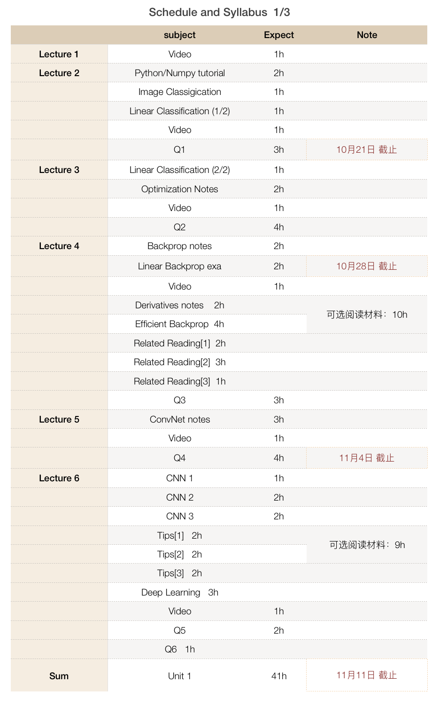

# CS231n

- 阅读材料： [CS231n Convolutional Neural Networks for Visual Recognition](http://cs231n.github.io/)
- 课程链接：
  - [2017 英文字幕版](https://www.youtube.com/watch?v=6niqTuYFZLQ&list=PLe7764SJVnV10-Nr7e0sBlC9J0LRf4sQo)
  - [2016 英文字幕版](https://www.youtube.com/watch?v=NfnWJUyUJYU&list=PLkt2uSq6rBVctENoVBg1TpCC7OQi31AlC)
  - [2016 中文字幕版](https://study.163.com/course/introduction/1003223001.htm)
- 我们参照 [Stanford Honor Code](https://communitystandards.stanford.edu/student-conduct-process/honor-code-and-fundamental-standard) ，简而言之就是作业过程中可以讨论算法，但不可以看别人的代码。

- 讨论组：
  - [Blog No.1](https://networkflow.net/forum/19-stanford-cs231n-convolutional-neural-networks-for-visual-recognition/) （这里有其他同学的解法，谨慎浏览，做完作业后可以来交流解法）
  - [Blog No.2](https://www.reddit.com/r/cs231n/)
- Term One Schedule:

- 我们预计12月30日完成全部课程；）

